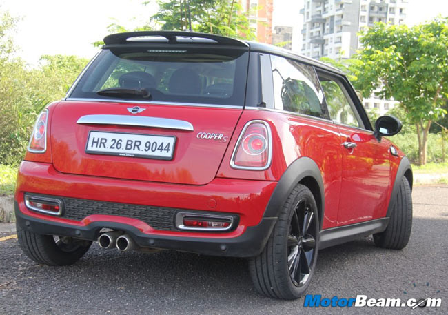
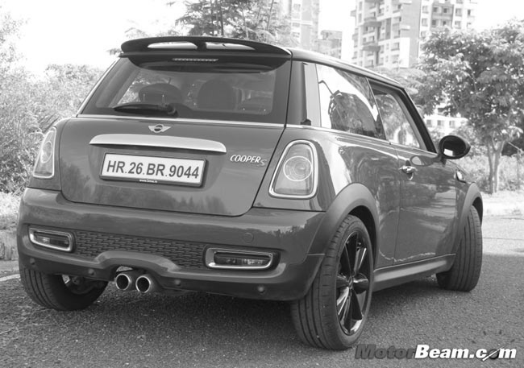
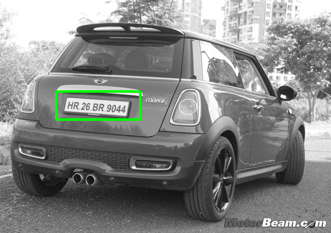
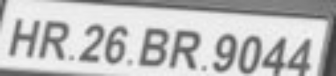

# Automatic-License-Number-Plate-Recognition
Automatic license number plate recognition using python's openCV library


## Requirements
- OpenCV
- Numpy
- pytesseract


## Instruction:
```python
python GUI.py  # Will run the GUI application
```

## Steps:






  

Detected License Plate Number: **HR26BR9044**